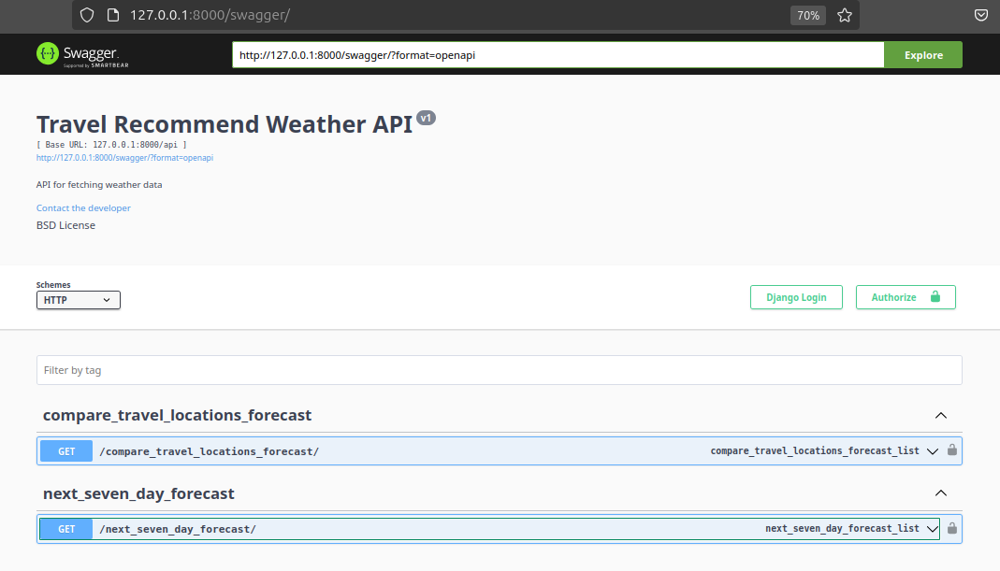
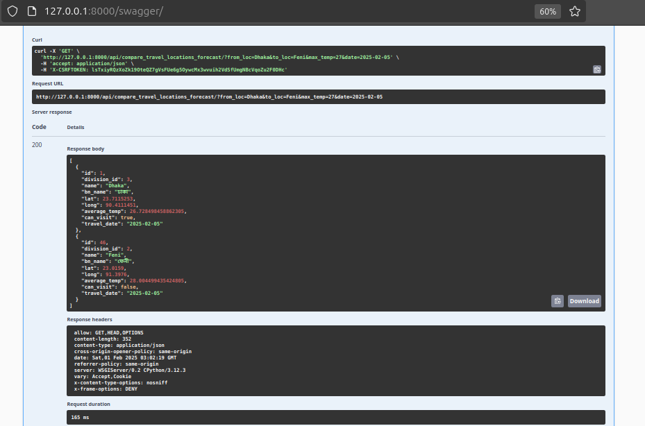
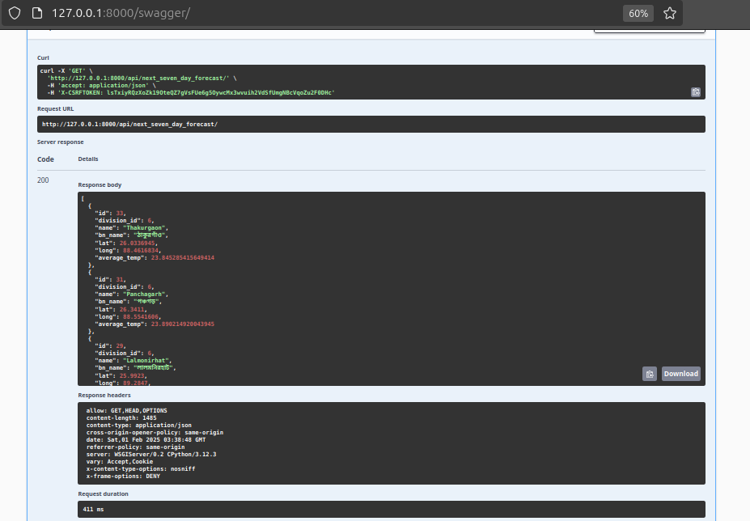

<div align="center">
    <h1>Travel Recommendation</h1>
</div>


<div align="center">
    
    
    
    
    
</div>


---

# Travel Recommendation API

This API provides weather-based travel recommendations for districts in Bangladesh. It includes two main endpoints:

1. **Compare Travel Locations Forecast**: Compares the weather conditions of two locations on a specific date.
2. **Next Seven Day Forecast**: Retrieves the coolest 10 districts based on the average temperature over the next 7 days.

---
## Indexes
- [Prerequisites](#prerequisites)
- [Database Setup in Docker](#database-setup-in-docker-optional---local)
- [Project Setup](#project-setup)
- [Create Virtualenv](#create-and-activate-virtual-environment)
- [Install New Libraries](#install-libraries)
- [Format & Lint Code](#apply-code-format--linting)
- [Run project](#run-the-project-locally)
- [Run test case](#run-test-case)
- [Create Superuser](#create-superuser)


---


### Prerequisites
- Python >= 3.10
- uv => `pip install uv`
- PostgreSQL


### Database setup in Docker (Optional - Local)
```shell
1. docker run -p 5432:5432 --name db -e POSTGRES_PASSWORD=postgres -d postgres
2. docker exec -it db bash
3. su - postgres
4. psql
5. create database <database_name>;
6. create user <database_user> with encrypted password 'password';
7. grant all privileges on database <database_name> to <database_user>;
8. ALTER USER <database_user> CREATEDB; # to run test case
9. exit 
```


### Project Setup:
```shell
1. git clone https://github.com/shohansk/travel_recommend.git
2. cd travel_recommend
3. cp .secrets.example.yaml .secrets.yaml
```
:warning: Please do not edit `requirements.txt` manually.


##### Create and Activate virtual environment
```shell
1. uv venv
2. source .venv/bin/activate
```


##### To add new libraries first update `pyproject.toml`.
```shell
uv pip compile -o requirements.txt pyproject.toml
```


##### Install libraries 
```shell
uv pip sync requirements.txt
```
##### Apply Code Format & Linting
```shell
1. ruff format . # format
2. ruff check . # lint
```
##### Run test case
```shell
1. pytest # run all test case
2. pytest --cov # check test coverage
3. coverage report -m # check coverage missing lines
```

### Run the project (locally)
```shell
1. python manage.py makemigrations
2. python manage.py migrate
3. bash entrypoint.sh # for load data
3. python manage.py runserver
```

##### Create superuser
```shell
python manage.py createsuperuser
```

---

<div align="center">
    
</div>

---
---
**Compare Travel Locations Forecast End Point**
```shell 
api/compare_travel_locations_forecast/?from_loc=Dhaka&to_loc=Feni&max_temp=27&date=2025-02-05
```
**Response**:
```json
[
  {
    "id": 1,
    "division_id": 3,
    "name": "Dhaka",
    "bn_name": "ঢাকা",
    "lat": 23.7115253,
    "long": 90.4111451,
    "average_temp": 26.728498458862305,
    "can_visit": true,
    "travel_date": "2025-02-05"
  },
  {
    "id": 46,
    "division_id": 2,
    "name": "Feni",
    "bn_name": "ফেনী",
    "lat": 23.0159,
    "long": 91.3976,
    "average_temp": 28.004499435424805,
    "can_visit": false,
    "travel_date": "2025-02-05"
  }
]
```
<div align="center">
    
</div>

---
---
**Next Seven Day Forecast:**
```shell 
api/next_seven_day_forecast/
```
**Response**:
```json
[
  {
    "id": 33,
    "division_id": 6,
    "name": "Thakurgaon",
    "bn_name": "ঠাকুরগাঁও",
    "lat": 26.0336945,
    "long": 88.4616834,
    "average_temp": 23.845285415649414
  },
  {
    "id": 31,
    "division_id": 6,
    "name": "Panchagarh",
    "bn_name": "পঞ্চগড়",
    "lat": 26.3411,
    "long": 88.5541606,
    "average_temp": 23.890214920043945
  },
  ...
]
```
<div align="center">
    
</div>

---